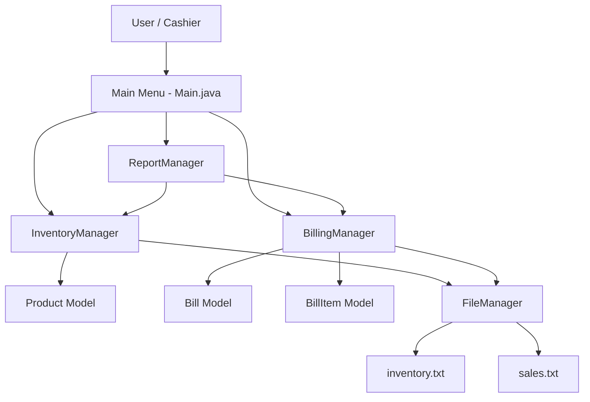
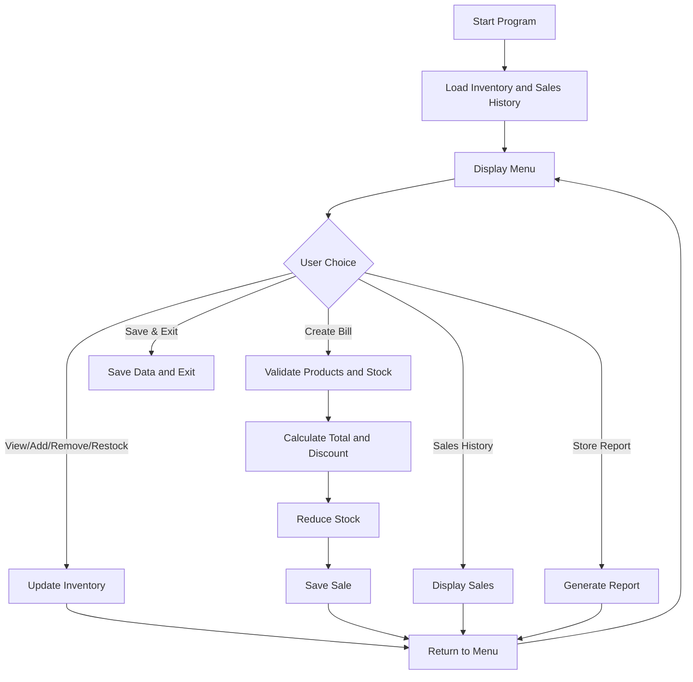
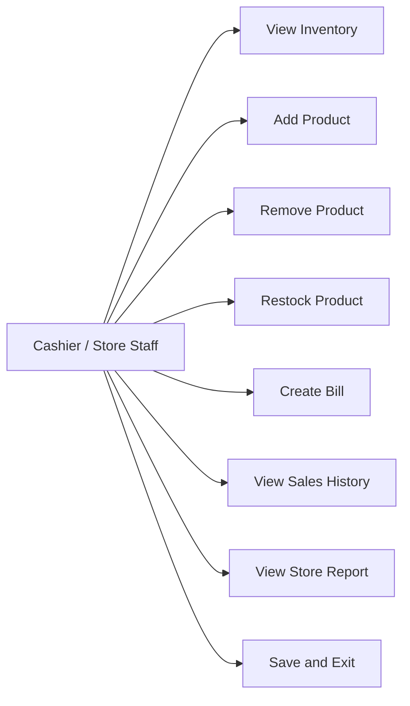
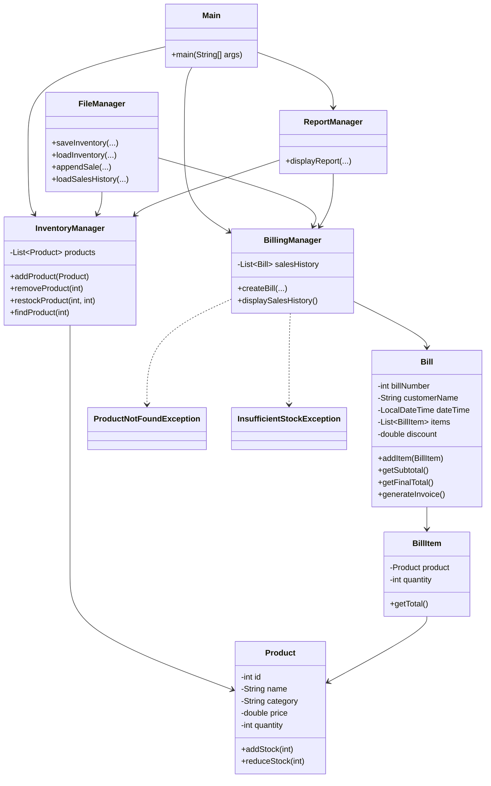
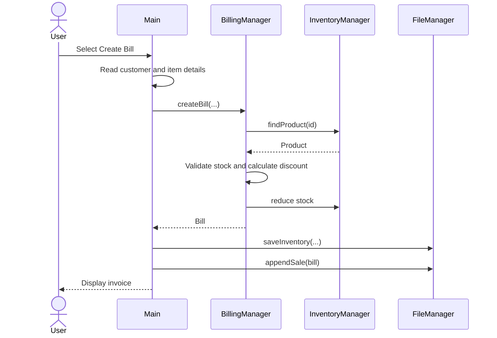

# Design Diagrams

These diagrams are written in Mermaid so they can be viewed directly on GitHub or copied into a report.

## 1. System Architecture

## 2. Workflow

## 3. Use Case Diagram

## 4. Class Diagram

## 5. Create Bill Sequence

## 6. Storage Design

The application uses simple text files for local data persistence.

### inventory.txt

Each line stores:

ID | Product Name | Category | Price | Quantity

Example:
101|Rice 5kg|Grocery|320.0|20

### sales.txt

Each line stores:

Bill Number | Customer Name | Date/Time | Subtotal | Discount | Final Total

Example:
1001|Customer|2026-09-17T18:00|1000.0|0.0|1000.0
